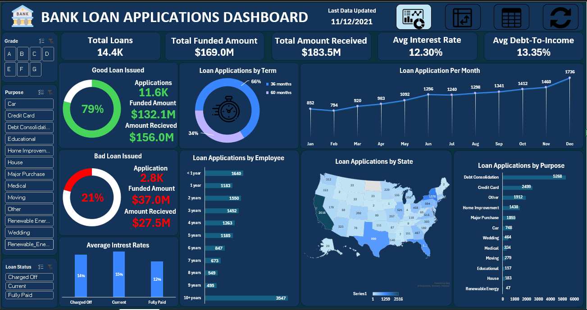
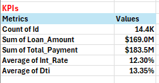
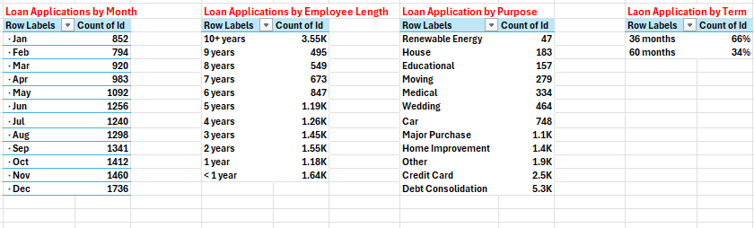
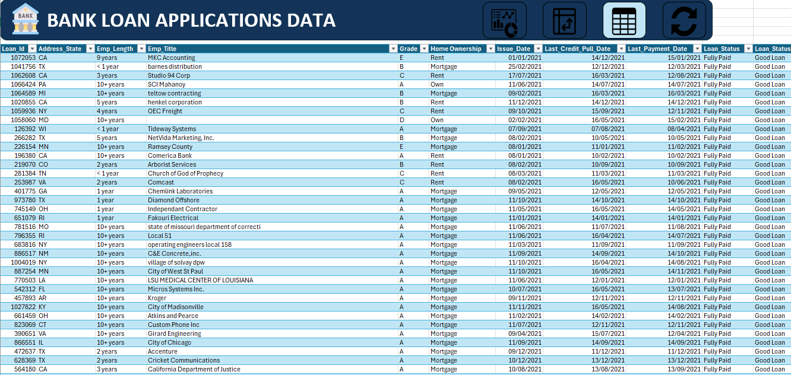

# Bank Loan Applications Dashboard

## The question that started this project

**Out of every 5 loans a bank approves, roughly 1 goes bad. Can you spot the difference between a good loan and a bad one before it happens — just by looking at the data?**

That's the question this dashboard is built to answer. It takes a raw loan applications dataset and turns it into a single view where risk, volume, and performance sit side by side, so the pattern isn't buried in rows of a spreadsheet — it's visible in seconds.

---

## Overview

This is an Excel dashboard built on a bank's loan applications dataset, covering loan amount, term, interest rate, grade, purpose, employment length, borrower state, and final loan status (Fully Paid, Current, or Charged Off). It's built entirely with PivotTables, PivotCharts, and Slicers on top of a raw transactional dataset.

The goal wasn't just to report numbers — it was to structure the data so three questions could be answered at a glance:
1. How much of the portfolio is healthy vs. at risk?
2. Where is that risk concentrated — by grade, purpose, term, or region?
3. Is pricing (interest rate) actually reflecting that risk?

**Data as of:** 11/12/2021

---

## Dashboard components

### KPIs

Five headline numbers pulled from PivotTables: **14.4K** total loans, **$169.0M** total funded, **$183.5M** total received, **12.30%** average interest rate, and **13.35%** average debt-to-income ratio. This is the summary a reader sees before drilling into anything else.

### Good Loan vs. Bad Loan, and Average Interest Rate by Status

The core risk split, built as a two-column PivotTable: **79%** of loans (11.6K applications, $132.1M funded, $156.0M received) are "Good" — Current or Fully Paid. **21%** (2.8K applications, $37.0M funded, $27.5M received) are "Bad" — Charged Off. Next to it, average interest rate by status: Charged Off 14%, Current 15%, Fully Paid 12%.

### Supporting breakdowns: Month, Employee Length, Purpose, Term

Four PivotTables driving the dashboard's charts:
- **Loan Applications by Month** — climbing steadily from 852 in January to 1,736 in December.
- **Loan Applications by Employee Length** — from under 1 year (1.64K) up through 10+ years (3.55K), with a dip through the middle tenure years (6–9 years sit lowest, 495–847).
- **Loan Application by Purpose** — led by Debt Consolidation (5.3K) and Credit Card (2.5K), down to Renewable Energy (47) at the bottom.
- **Loan Application by Term** — 66% of loans at 36 months, 34% at 60 months.

### Underlying data

The dashboard sits on top of a row-level loan table: Loan_Id, Address_State, Emp_Length, Emp_Title, Grade, Home_Ownership, Issue_Date, Last_Credit_Pull_Date, Last_Payment_Date, and Loan_Status (with a derived Good/Bad Loan flag). Every PivotTable and chart in the dashboard is built directly from this table, so any of the summary numbers can be traced back to individual loan records.

---

## How the dashboard answers the hook question

Put together, the visuals actually undercut the intuitive story. You'd expect Charged Off loans to carry the highest interest rates, since risk is supposed to be priced in — but here, Charged Off loans average **14%**, while loans still Current average **15%**, and only Fully Paid loans sit meaningfully lower at **12%**. That's a real signal: the loans that eventually went bad weren't priced as the riskiest ones in the book. Rate alone doesn't predict default here.

Where the risk actually shows up is in the mix, not the price: Debt Consolidation and Credit Card purposes dominate volume by a wide margin, 36-month terms make up two-thirds of the book, and the employment-length distribution is heaviest at the two extremes (under 1 year, and 10+ years) with a dip in between. Cross-filtering by Grade, Purpose, and Loan Status (using the Slicers) is how you'd actually isolate where that 21% "bad loan" bucket concentrates — the dashboard is built so that question can be answered interactively rather than guessed at.

---

## Q&A

**- Q: What share of the portfolio is currently underperforming?** 

21% of loans (2.8K applications) are classified as bad/Charged Off, against 79% good.

**- Q: Did the bank recover more than it funded overall?**

Yes — $183.5M received against $169.0M funded, a net positive of about $14.5M across the whole portfolio. But that's a portfolio-level average; the "bad loan" bucket alone shows $37.0M funded against only $27.5M received, a shortfall of $9.5M.

**- Q: Which loan purpose carries the most volume, and which the least?**

Debt Consolidation is highest at 5.3K applications, more than double the next category (Credit Card, 2.5K). Renewable Energy is lowest, at just 47 applications.

**- Q: Do longer loan terms mean more risk?**

The dashboard shows loan volume by term (66% at 36 months, 34% at 60 months) but not default rate by term specifically — worth checking by cross-filtering Loan Status against Term as a follow-up.

**- Q: Is interest rate a reliable warning sign for default?**

Not on its own. Charged Off loans average 14% interest — lower than Current loans at 15%. If rate were the main risk signal, you'd expect the opposite.

**- Q: Was application volume growing or shrinking over the year?**

Growing consistently — from 852 applications in January to 1,736 in December, more than double.

**- Q: Which employment-length group applies for the most loans?**

Borrowers with 10+ years of employment are the single largest group (3.55K), followed by those with under 1 year (1.64K) — the two ends of the tenure spectrum apply the most, with a dip through the middle years (6–9 years).

**- Q: What fields does the underlying dataset actually contain?**

Loan ID, borrower state, employment length and title, loan grade, home ownership status, issue date, last credit pull date, last payment date, and loan status — with a derived Good/Bad Loan flag used to drive the risk breakdown.

---

## Tools

Excel (PivotTables, PivotCharts, and dashboard design). Filters are built as Slicers on Grade, Purpose, and Loan Status for interactive drill-down.
